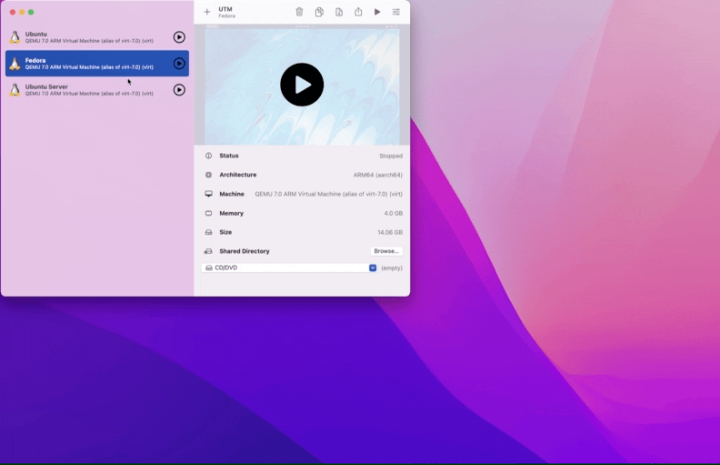

# Setting up PERN on Fedora

PERN stands for PostgreSQL, Express, React and Node.js. This tutorial will show you how to setup the entire PERN stack on Fedora.

## PERN Installation

PostgreSQL is available to install through dnf:

```
_insert command to install postgres_
```

## Node.js Installation

Node.js can be insalled like this:

```
_insert command to install node_
```

## Configuration

To start up Node.js and PostgreSQL on system startup, you must do the following:


